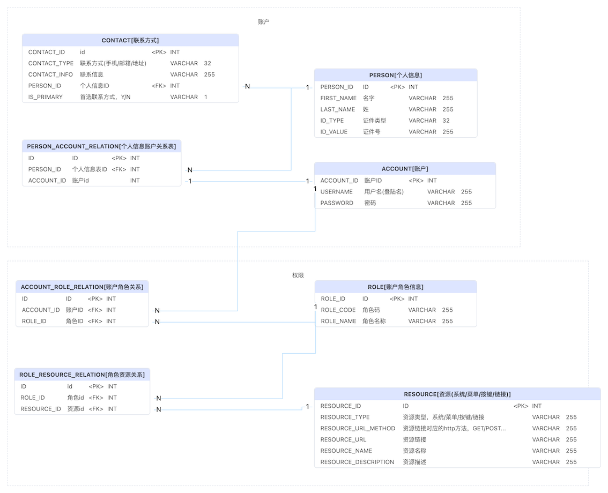
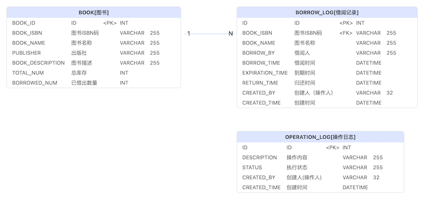

## 图书管理系统


### 角色及在系统中拥有的权限功能（业务需求）

#### 系统管理员
* 角色授权 - 给普通用户授予管理员权限
#### 图书管理员
*  图书入库
*  图书报废（破损 遗失）
*  登记读者借书
*  登记读者还书
*  搜索图书
#### 读者
*  搜索图书


### 表设计
#### 账户体系关系

#### 图书管理关系
  


### 工程目录结构
```
books-mgt            //父工程
├── LICENSE
├── README.md
├── books-mgt-bom    //bom工程，jar包版本管理，为了方便父工程下多个子工程依赖的jar包的版本管理
│     └── pom.xml
├── books-mgt-web    //主工程
│     ├── pom.xml
│     └── src
│           ├── main
│           │     ├── java
│           │     └── resources
│           └── test
│               └── java
├── db               //数据库模型
│     ├── books-management-system.pdma.json   //PDManer 数据库建模定义文件
│     ├── books-mgt-mysql-ddl.sql
│     ├── 图书管理关系.png
│     └── 账户体系关系.png
└── pom.xml
```

### 工程技术框架选型
* SpringBoot 
* Spring Mvc 
* Spring Security 
* Spring Cache
* Mybatis-Plus
* Swagger
* Spring validation
* H2
#### 权限控制
权限控制是基于Spring Security做的针对(http method + url)为颗粒度进行权限控制
#### 操作日志
基于spring aop实现的操作日志，会将注解中配置的内容（带变量通配符）与实际变量值生成操作日志写入数据库操作日志表中<br>
具体代码实现详见com.github.wangcaide.common.log下代码
#### 统一异常处理
详见代码 com.github.wangcaide.common.exception.GlobalExceptionHandler
#### 统一返回值控制
详见代码 com.github.wangcaide.common.model.R
#### 基于环境的配置分离
* application.yaml
* application-dev.yaml
* application-prod.yaml
#### swagger 
选用的是knife4j，knife4j对swagger进行了一层封装，ui易用
#### 缓存
选用 Spring Cache，目前用的是内存缓存caffeine，可通过配置及依赖jar包切换其他的cache如redis
#### 校验
Spring validation
#### UI
由于周末有事，没有太多时间，只是把登陆页面写了。。。

### 快速开始
我本地的环境版本
* openjdk 11.0.15
* Maven 3.8.6
* git 2.33.0
* IntelliJ IDEA 2022.2.3

```
git clone https://github.com/wangcaide/books-mgt.git
cd books-mgt/books-mgt-bom
mvn install
cd ..

```